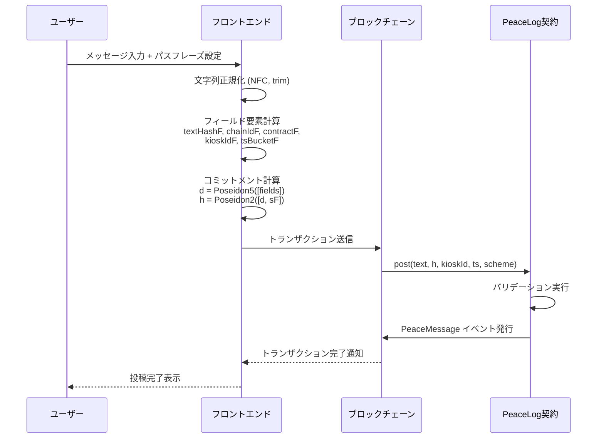
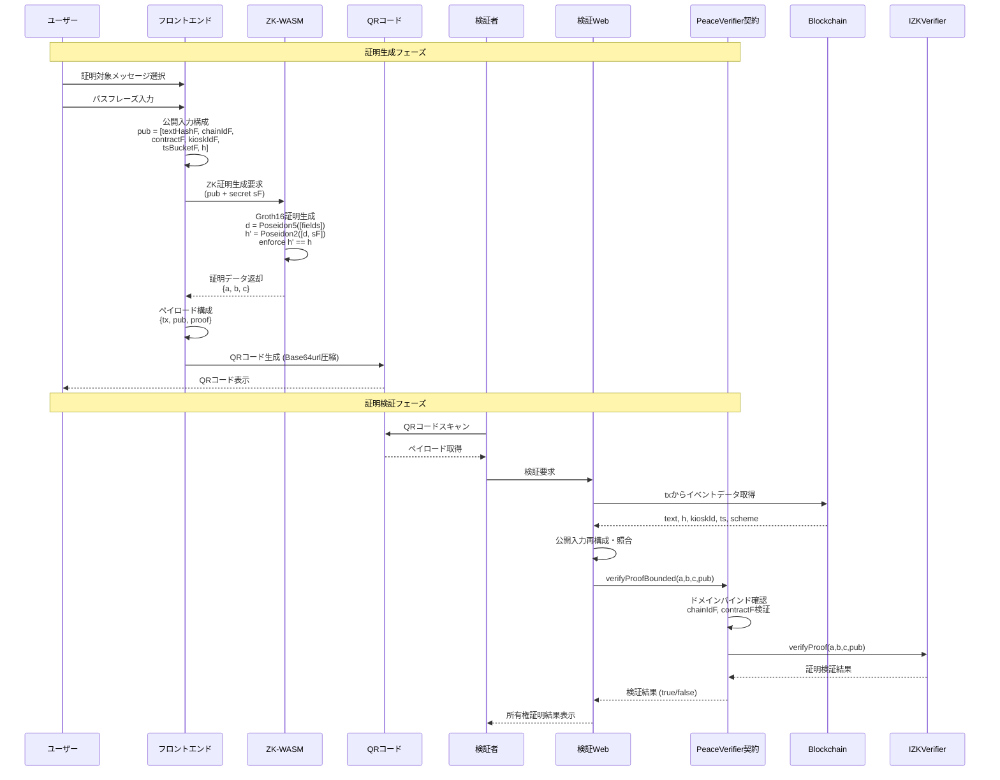
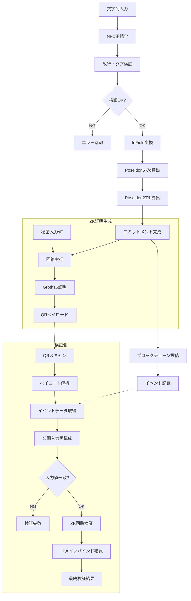

# Peace Message - ゼロ知識証明仕様書

## 1. ドメイン定義と正規化（前提）

### 文字列正規化
- **正規化プロセス**: NFC → trim → 改行は `\n` に統一
- **合言葉制約**: 1行のみ（改行・タブ禁止）
- **フィールド化**: `toField(bytes) = uint256(keccak256(bytes)) % q`
  - `q = BN254: 21888242871839275222246405745257275088548364400416034343698204186575808495617`

これでフロント・回路・コントラクト（必要なら）を完全一致させる。

### フィールド要素の定義

```javascript
textHashF  = toField(utf8(NFC(text)))
chainIdF   = toField(abi.encodePacked(uint256(8453)))
contractF  = toField(abi.encodePacked(address(PeaceLog)))
kioskIdF   = toField(utf8(kioskId))           // ASCII/UTF-8
tsBucketF  = toField(abi.encodePacked(uint64(floor(ts/60))))
```

### コミットメント計算（2段Poseidon）

```javascript
d = Poseidon5([textHashF, chainIdF, contractF, kioskIdF, tsBucketF])
h = Poseidon2([d, sF])   // sF = toField(utf8(NFC(secret)))
```

- **スキーム**: `1`（将来変更時にイベントで区別）

## 2. コントラクト設計

### PeaceLog.sol（記録専用）

オンチェーンにはイベントだけを残す。`h` はフロントで計算済みの値を受け取り、そのままemit（再計算しない低ガス版）。必要なら"安全版"としてPoseidon再計算を入れた関数を別途用意。

```solidity
// SPDX-License-Identifier: MIT
pragma solidity ^0.8.24;

contract PeaceLog {
    event PeaceMessage(
        bytes32 indexed messageId,   // 任意: keccak256(abi.encode(text,h,kioskId,ts,scheme))
        string  text,                // 正規化済み本文（公開）
        bytes32 h,                   // コミットメント（32Bに詰める: 下記注）
        string  kioskId,             // 端末ID
        uint64  ts,                  // 端末時刻(秒) もしくは block.timestamp に置換
        uint8   scheme               // 1
    );

    function post(
        string calldata text,
        bytes32 h,
        string calldata kioskId,
        uint64 ts,                   // 端末時刻採用なら入力、ブロック時刻なら不要
        uint8 scheme                 // 1 固定
    ) external {
        // 軽いバリデーション（長すぎる文字列の拒否など）
        require(bytes(text).length <= 1024, "text too long");
        require(scheme == 1, "scheme");

        // 任意: messageId を決定論的に
        bytes32 messageId = keccak256(abi.encode(text, h, kioskId, ts, scheme));
        emit PeaceMessage(messageId, text, h, kioskId, ts, scheme);
    }
}
```

> **メモ**: `h` は本来Fr要素。QRやEtherscanで扱いやすいよう、Frを32Bにパックして`bytes32`で持つ（Fr < 2^254 なので32Bに収まる）。フロント/回路側と表現を統一すること。

### PeaceVerifier.sol（read検証）

snarkjs等で自動生成されたGroth16/PLONK Verifierを薄くラップする。任意で有効期限チェックを追加できる。

```solidity
// SPDX-License-Identifier: MIT
pragma solidity ^0.8.24;

interface IZKVerifier {
    function verifyProof(
        uint256[2] calldata a,
        uint256[2][2] calldata b,
        uint256[2] calldata c,
        uint256[] calldata pub
    ) external view returns (bool);
}

contract PeaceVerifier {
    IZKVerifier public zk;
    address public immutable peaceLog;
    uint256 public immutable chainIdF_expected;
    uint256 public immutable contractF_expected;

    constructor(address _zk, address _peaceLog) {
        zk = IZKVerifier(_zk);
        peaceLog = _peaceLog;
        // toField(chainId) / toField(peaceLog) をデプロイ時に固定（省略形）
        chainIdF_expected = uint256(keccak256(abi.encodePacked(uint256(8453)))) % Q;
        contractF_expected = uint256(keccak256(abi.encodePacked(_peaceLog))) % Q;
    }

    // pub = [textHashF, chainIdF, contractF, kioskIdF, tsBucketF, h(=Fr), (任意) t_issue, ttlSec]
    function verifyProofBounded(
        uint256[2] calldata a,
        uint256[2][2] calldata b,
        uint256[2] calldata c,
        uint256[] calldata pub
    ) external view returns (bool) {
        // 期待するドメインにバインド（クロスチェーン/他コントラクトへのリプレイ防止）
        if (pub[1] != chainIdF_expected) return false;
        if (pub[2] != contractF_expected) return false;

        // 期限付きにする場合は最後尾でチェック（任意）
        // if (pub.length >= 8) {
        //     uint256 t_issue = pub[6];
        //     uint256 ttlSec  = pub[7];
        //     if (block.timestamp > t_issue + ttlSec) return false;
        // }

        return zk.verifyProof(a, b, c, pub);
    }

    uint256 constant Q = 21888242871839275222246405745257275088548364400416034343698204186575808495617;
}
```

read（`eth_call`）だけを使うのでガスは不要。`pub[1]`, `pub[2]` によるドメインバインディングで他ネット/他コントラクトへの使い回しをブロック。

## 3. ZK回路設計（circom想定）

小回路で良いのでGroth16推奨（QRに乗せやすい）。PLONKでも可。

### 公開入力
```
textHashF, chainIdF, contractF, kioskIdF, tsBucketF, h(Fr), [t_issue, ttlSec] // []は任意
```

### 秘密入力
```
sF
```

### 制約
```
d  = Poseidon5([textHashF, chainIdF, contractF, kioskIdF, tsBucketF])
h' = Poseidon2([d, sF])
enforce h' == h
```

### サンプル回路（概念、実装ではcircomlibのposeidonを使用）

```circom
pragma circom 2.1.6;
include "circomlib/poseidon.circom";

template PeaceCircuit() {
    // public
    signal input textHashF;
    signal input chainIdF;
    signal input contractF;
    signal input kioskIdF;
    signal input tsBucketF;
    signal input h;            // Fr

    // optional
    // signal input t_issue;
    // signal input ttlSec;

    // private
    signal input sF;

    signal d;
    component H5 = Poseidon(5);
    H5.inputs[0] <== textHashF;
    H5.inputs[1] <== chainIdF;
    H5.inputs[2] <== contractF;
    H5.inputs[3] <== kioskIdF;
    H5.inputs[4] <== tsBucketF;
    d <== H5.out;

    component H2 = Poseidon(2);
    H2.inputs[0] <== d;
    H2.inputs[1] <== sF;
    H2.out === h;
}
```

### 鍵生成（Groth16）

```bash
circom peace.circom --r1cs --wasm --sym
snarkjs groth16 setup peace.r1cs powersOfTau28_hez_final_*.ptau peace_0000.zkey
snarkjs zkey contribute peace_0000.zkey peace_final.zkey
snarkjs zkey export verificationkey peace_final.zkey verification_key.json
snarkjs zkey export solidityverifier peace_final.zkey Verifier.sol
```

`Verifier.sol` をデプロイし、アドレスを `PeaceVerifier` に渡す。

## 4. フロントの公開入力構成とQRペイロード

### 公開入力（circomの順序と一致）

```javascript
pub = [
  textHashF,
  chainIdF,        // toField(8453)
  contractF,       // toField(PeaceLog)
  kioskIdF,
  tsBucketF,
  hFr,             // Fr表現（bytes32→uint256）
  // t_issue, ttlSec  // 任意
]
```

### Groth16証明形式（snarkjs準拠）

```json
{
  "a": ["0x..","0x.."],
  "b": [["0x..","0x.."],["0x..","0x.."]],
  "c": ["0x..","0x.."]
}
```

### QRペイロード例

QRはBase64url圧縮で1KB前後に収める。

```json
{
  "tx": "0x<txHash>",
  "pub": ["<u256>","<u256>", "..."],
  "proof": {
    "a": ["0x..","0x.."],
    "b": [["0x..","0x.."],["0x..","0x.."]],
    "c": ["0x..","0x.."]
  }
}
```

検証Webは `tx` からイベント `text,h,kioskId,ts,scheme` を取得し、前処理で `textHashF,kioskIdF,tsBucketF` を再構成、`chainIdF,contractF` は定数化、`pub` と一致するかをチェックしてから `PeaceVerifier.verifyProofBounded` を `eth_call`。

## 5. オプション設計

### 有効期限付き証明
- `t_issue`, `ttlSec` を公開入力に追加
- `PeaceVerifier`で `block.timestamp <= t_issue + ttlSec` をreadチェック
- 証明と時刻がバインドされ改ざん不能

### 安全版投稿
- Gas増はあるが、`PeaceLog`側でPoseidon再計算して `require(h == calcH)` を入れる
- フロントの誤実装や改ざんを検出可能（Solidity版PoseidonT5/T2をリンク）

## 6. セキュリティ/一貫性ポイント

- **toField統一**: 定義を文書化し、回路・フロント・（必要なら）コントラクトで完全一致させる
- **ドメインバインド**: `chainIdF`/`contractF` を公開入力に含め、Verifier側でも固定値と突き合わせる（クロスデプロイ耐性）
- **文字列正規化**: 共有ユーティリティにして、投稿UIと検証UIで同じ関数を使う
- **合言葉セキュリティ**: 端末外へ送らない。WASM内で処理し、生成後に即メモリクリア
- **証明の非決定性**: proofは毎回ランダム。コピーされてもOKだが、新しい本物を作れるのは本人だけ

## 7. システムフロー

### メッセージ投稿フロー



### ゼロ知識証明生成・検証フロー



### セキュリティ・整合性確保フロー



## 8. テスト観点

### 基本機能テスト
- ✅ 正しいsで `true`、1文字違いのsで `false`
- ✅ 異体字・結合文字（NFC）テスト、改行禁止のバリデーション
- ✅ `chainId`/`contract`を差し替えた`pub`で `false`（ドメインバインドの確認）
- ✅ 同一入力で複数回生成したproofは全て `true`（非決定性確認）

### オプション機能テスト
- ⏳ 任意: 期限切れで `PeaceVerifier` が `false`

---

**© 2025 Peace Message. All rights reserved.**